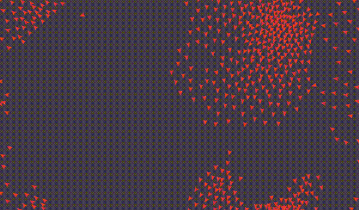

# Rust / WebAssembly boids simulation

Personal learning project for Rust and WebAssembly using a similar setup as the Game of Life tutorial from the [Rust and WebAssembly book](https://rustwasm.github.io/docs/book/introduction.html). The boids simulation is a port of Daniel Shiffmans [Flocking example for Processing](https://processing.org/examples/flocking.html). The project is using the [wasm-pack-template](https://github.com/rustwasm/wasm-pack-template) for compiling Rust to WebAssembly and [create-wasm-app](https://github.com/rustwasm/create-wasm-app) for the web app.



### Building

To compile the WebAssembly files run ```wasm-pack build``` from the root directory.

### Running

To run the project locally in the browser, first install dependencies using ```cd www && npm install```, then run with ```npm run start```